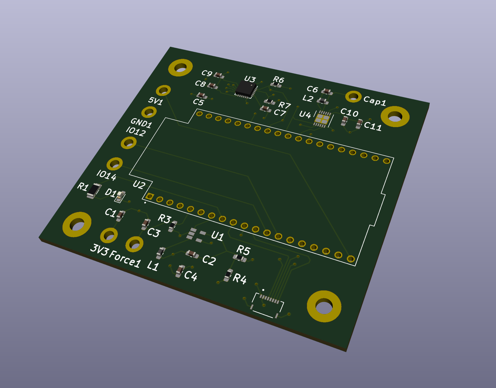

# Capstone Project
This is the Capstone project for Team 7 at The Ohio State University Department of Electrical and Computer Engineering

# Software
This project includes a websocket server, written in Python3, that exposes the sensor data that was read over Bluetooth to another process. it also includes an example client, which is a webpage that uses a websocket and charts.js to plot the received data in real time. 

## Server
The server is a very basic implementation, provided as a proof of concept. The server starts a websocket server, which waits for connections on localhost port 8888. When it receives a connection, is starts scanning for Bluetooth devices, and connects to the ESP32 device. After connecting, it starts streaming the received accelerometer, gyroscope, and force sensor readings to the connected websocket client. If additional sensors are added and supported by the firmware in the future, the values sent and received in the websocket server will need to be updated.

# Firmware
This project uses the ESP32 port of Micropython. The most recent firmware versions for the ESP32 are located in the firmware directory of the repository, along with the micropython firmware files

## Getting started
To get started developing with Micropython for this project, the following steps are required:
1. Install [Python](https://www.python.org/downloads/), if not already installed
2. Use pip to install [esptool](https://pypi.org/project/esptool/) and [adafruit-ampy](https://pypi.org/project/adafruit-ampy/) by running `pip install esptool adafruit-ampy`
3. Ensure the `make` utility is installed (for Windows users, see WSL)

The following tools are highly recommended:
1. [VS Code](https://code.visualstudio.com), with the python extension installed
2. A serial port monitor, such as the one included with the [Arduino IDE](https://www.arduino.cc/en/Main/Software), the GNU utility `screen`, or the terminal emulator program [PuTTY](https://www.chiark.greenend.org.uk/~sgtatham/putty/latest.html)

### Flashing the firmware
To flash the firmware, run `make flash` in the root directory of the repository. This will flash the provided micropython firmware for the ESP32. There are two versions of the firmware, one compiled with the version 3 of the ESP-IDF toolchain and one compiled with version 4. The default option flashes the version 4 variant of the firmware.

This process can take a while.

### Working with micropython files on the ESP32
The below table shows the commands that can be run using the makefile to work with files on the ESP32. Most of the commands require the port as an argument to the command. The port that the ESP32 is attached to depends on what operating system you are running. To find the port on Mac, run `ls /dev/tty.*` in the terminal to get a list of currently attached serial ports. For windows, the port is a COM port, and can be found by opening the Device Manager and navigating to the ports list.

Command | Arguments | Description | Example
------- | --------- | ----------- | -------
`make flash` | `port` | Flashes the micropython firmware to the ESP32 | `make flash port=/dev/tty.usbserieal-14120`
`make list` | `port` | Lists the files currently on the ESP32 | `make list port=/dev/tty.usbserial-14120`
`make put` | `port`, `file` | Loads a file from the local filesystem to the ESP32's internal filesystem | `make put port=/dev/tty.usbserial-14120 file=software/src/boot.py`
`make show` | `port`, `file` | Gets and prints out the contents of a file currently on the ESP32 | `make show port=/dev/tty.usbserial-14120 file=main.py`
`make reset` | `port` | Performs a hard reset of the ESP32 | `make reset port=/dev/tty.usbserial-14120`

To get a running demo of the latest code in the repository, each of the micropython files in the [firmware](https://github.com/gworkman/capstone-ece4900/tree/master/firmware) directory should be loaded using the `make put` command shown above.

### Overview
The following is a brief description of each of the files in the micropython firmware.

`boot.py`: This file is executed once on power reset. It simply turns of the ESP32 debugging, which clutters the serial port output.

`main.py`: This is where all of the business logic of the application occurs. This file is responsible for registering Bluetooth services, accepting Bluetooth connections, reading the sensor values, sending data packets, and the sleep modes. Most of the required future changes to this application will occur here.

`ble_advertising.py`: This file contains helper functions to create Bluetooth advertising payloads that are broadcast while the device is waiting for a connection. It specifies the name of the device, services that is has, and more. 

`imu.py`: This file has the logic for reading sensor data for the MPU6050. This file was referenced from the micropython MPU9x50 library, found [here](https://github.com/micropython-IMU/micropython-mpu9x50).

`vector3d.py`: This file is required by `imu.py`, and is a generalized abstraction of the three-axis sensor data values, particularly the gyroscope and accelerometer data.

# Hardware
This project includes a custom-designed add-on board for the ESP32 to mount a variety of sensors in a small package.

## Getting started
If you just want to purchase the board, you can use the gerber files in the `hardware/output.zip` file. A bill of materials and PDF of the schematic is also included in the hardware/output directory for reference.
To make changes to the design of the board, you will need KiCad, a free PCB design software. Just open the `hardware.pro` file in KiCad, then you are good to start making changes. If the schematic doens't load in some of the symbols correctly, you might need to update the library paths to point to the `hardware/libraries` folder for the project.

## Overview
The schematic includes several components. First is the ESP32 microcontroller, which suppies the power and ground for the rest of the circuit. This component has connections to read data from and control other parts of the circuit.

Second, the MPU6050 contains all of the circuitry to ensure that this accelerometer/gyro chip works as expected. It has connections to the ESP32 in the form of I2C SDA and SCL lines, as well as a configurable interrupt line. 

Third, the capacitive presence sensor chip, the FDC2212, has the circuitry that sets the correct sensor oscillation frequency, as described in the datasheet. However, it also requires a capacitive plate to work effectively, which can be externally mounted by soldering a wire to the capacitive plate and the soldering point. The chip has inputs and outputs to the microcontroller via the I2C SDA and SCL lines, as well as an interrupt and reset line.

Next, the acoustic time of flight sensor block is comprised of a connector and a 1.8v voltage regulator. The development board that the chip is mounted to has all of the required circuitry, it simply requires 1.8v and a connector and ribbon cable to be able to correctly operate.

Finally, the force-sensitive resistor is a relatively simply circuit. It uses a voltage divider circuit to vary the output voltage with the pressure applied to the force sensor. The analog voltage is read by the microcontroller's ADC.

## Notes
One thing to keep in mind while changing the board layout design is the position of the decoupling capacitors. These should generally be placed as close to the power supply pins of each of the chips as possible, which helps to reduce noise and get accurate readings from the sensors.

There are several extra IO pins that are exposed to allow for expansions of the board to other features. IO pin 12 is currently used in the prototype of the firmware as a reset button. This feature is configurable in the firmware.

Finally, some of the pins on the ESP32 can only be used as inputs. These pins are labelled in a note within the schematic.

## Rendering
The below image is a rendering of the final design of the hardware for this project. The rendering shows almost all of the passive components on the board, with most of the chips. It does not include the connector for the acoustics sensor (bottom right) or the ESP32 development board (which is shown with the outline). It includes mounting holes in each of the corners for securely fastening the device.

 